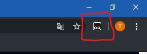

# Skript som förenklar skickandet av tulllistan.
#### Hej, här är instruktioner för hur skriptet installeras.

Instuktioner
---

## STEG 1. Installera en skripthanterare till vald webbläsare
- [Tampermonkey för Google Chrome](https://chrome.google.com/webstore/detail/tampermonkey/dhdgffkkebhmkfjojejmpbldmpobfkfo)
- [Tampermonkey för Mozilla Firefox](https://addons.mozilla.org/en-US/firefox/addon/tampermonkey/)

När scripthanteraren har installerat bör du se en av följande iconer i webbläsaren. 
I Google Chrome: 
 
I Mozilla Firefox: 

## STEG 2. Installera skriptet till skripthanteraren
 - Klicka på en av skript-länkarna nedan och klicka på Installera
 
   - [Jouni N](https://github.com/transmartoblar/CustomsFormAutomation/raw/master/Scripts/CustomsFormAutomation-Jouni-N.user.js)
   - [Kai K](https://github.com/transmartoblar/CustomsFormAutomation/raw/master/Scripts/CustomsFormAutomation-Kai-K.user.js)
   - [Lars W](https://github.com/transmartoblar/CustomsFormAutomation/raw/master/Scripts/CustomsFormAutomation-Lars-W.user.js)
   - [Laura H](https://github.com/transmartoblar/CustomsFormAutomation/raw/master/Scripts/CustomsFormAutomation-Laura-H.user.js)
   - [Niclas A](https://github.com/transmartoblar/CustomsFormAutomation/raw/master/Scripts/CustomsFormAutomation-Markku-L.user.js)
